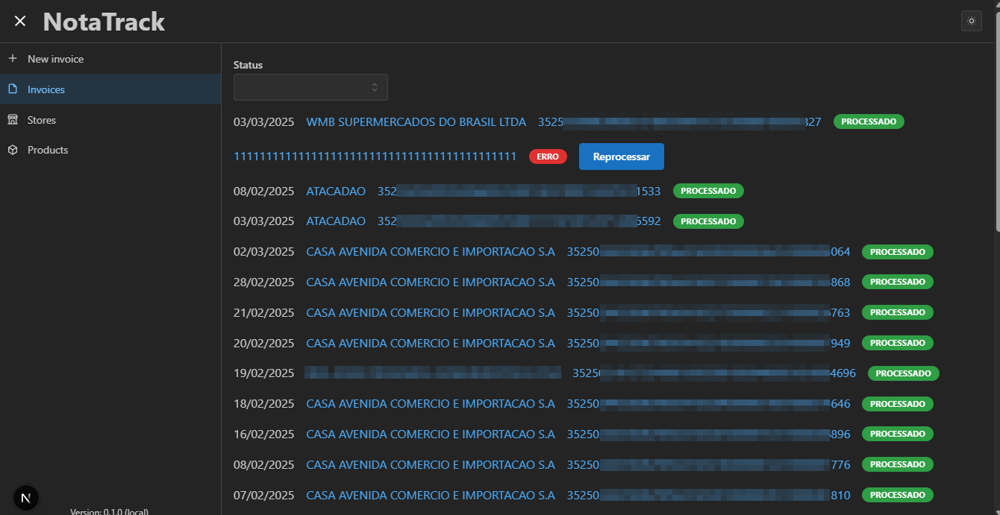

# NotaTrack

## Funcionalidades
- Importar notas fiscais emitidas no CPF
- Buscar dados de notas fiscais emitidas no CPF. Cadastrando lojas, produtos e seus preços
- Importar notas fiscais utilizando o QrCode da nota

Add images




## Rodando o projeto
- Clone o repositório
- Instale as dependências
  ```bash
  npm ci
  ```
- Inicialize o servidor
  ```bash
  make app
  ```
- Acesse o endereço `http://localhost:3000`

## Limitações
### Tanto a importação de notas fiscais quanto a busca dos dados das mesmas são protegidas por captcha
Isso dificulta a automação desses processos ou requer a utilização de serviços de terceiros para quebrar o captcha (como o [2Captcha](https://2captcha.com/)).

### Apenas o estado de SP é suportado. Tanto a busca de notas fiscais emitidas no CPF e importação dos dados da nota
O suporte para novos estados pode ser adicionado conforme a necessidade

### As interfaces Web das notas fiscais não expõem dados identificadores, como o código de barras, portanto a correlação de produtos não é automatizável
Alguns provedores pagos, como o [InfoSimples](https://infosimples.com/) fornecem tais dados, porém é uma API paga.

## Configurações
Para configurar as opções da aplicação, crie um arquivo `.env` na raiz do projeto com as seguintes variáveis de ambiente:
- `TWO_CAPTCHA_API_KEY` (opcional): Chave de API do 2Captcha. Se existir, a aplicação irá utilizar o serviço para quebrar captchas. Caso contrário, um browser será aberto para que o usuário possa resolver o captcha manualmente.
- `PUPPETEER_BROWSER_ENDPOINT` ou `PUPPETEER_WS_ENDPOINT` (opcionais): Endpoints do browser do Puppeteer. Se existirem, a aplicação irá utilizar o browser já existente. Caso contrário, um novo browser será aberto.
- `NEXT_PUBLIC_DEBUG` (opcional): Colocar como `true` habilitará o modo de debug, que exibirá informações adicionais no console do navegador e no terminal do server.

### Utilizando o próprio navegador como browser da aplicação

#### Chrome

Inicialize o Chrome com a flag `--remote-debugging-port=9222` e configure a variável de ambiente `PUPPETEER_BROWSER_ENDPOINT` com o valor `http://localhost:9222`.

## TODOs
- [ ] Adicionar suporte para mais estados
- [ ] Permitir _merge_ de produtos
- [ ] Relatórios
  - [ ] Produtos comprados no mês (com valor total)
  - [ ] Lojas mais frequentadas
  - [ ] Produtos mais comprados
- [ ] Possibilidade de rodar o projeto via Docker
- [ ] Permitir o uso de outros bancos de dados
